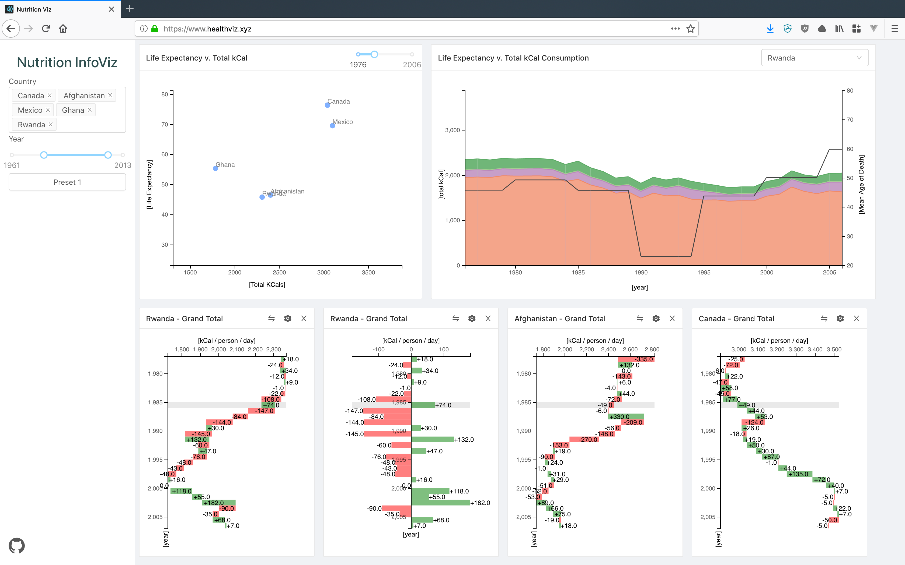

## World Diet Viz

### Summary

This project was built for UVic's information visualization class with the intention to understand how diet composition impacts mean age of death around the world.

Data was assembled from various data dumps provided by the World Health Organizations, in particular the Food and Aggriculture Organization.

We found that there was no real correlation. However, this in itself is interesting because it suggests that diet is not the predominant factor in the increasing life expectancy around the world. The full report can be found [here](https://drive.google.com/open?id=1V2_h_b8PuZ2cTtkUE7fzXfRzBF27HtX3).

### Screenshots

### Process

~ Under construction (Need to fill this in at some point) ~

#### Data

##### Data Collection

##### Data Transformation

##### Data Aggregation

##### Data Storage

#### Backend (GraphQL)

##### Accessing Data

##### Filtering Data

#### Frontend (React)

##### Platform

##### Requesting Data (GraphQL)

##### Visualizing

##### Interaction

### Sources

[Diet Data -- Food and Agriculture Organization of the United Natations](http://www.fao.org/faostat/en/#data/FBS)

[Life Expectancy Data -- Zijdeman, Richard; Ribeira da Silva, Filipa, 2015, "Life Expectancy at Birth (Total)"](https://datasets.socialhistory.org/dataset.xhtml?persistentId=hdl:10622/LKYT53) 

[Inspriation -- Our World In Data](https://ourworldindata.org/diet-compositions)
